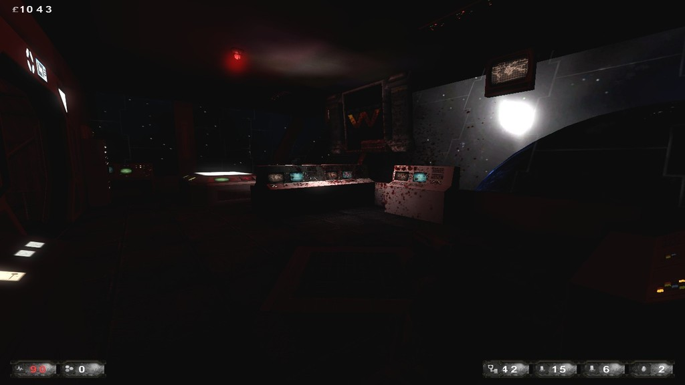

[Hot Fix]: <https://www.mediafire.com/file/et7dwjasj46xaec/AliensHotFix.zip/file> 'FIX ME!'

> If you have any issues install the [Hot Fix].

Giger's creatures came to have some fun in KF. Recommended to play on medium game difficulties and full team.

Cmdline for dedicated servers:

```bash
Game=AliensKFGameType.AliensKFGameType?Mutator=AliensKFServerPerksMut.AliensKFServerPerksMut,AliensKFXenos.MutAliensPath,AliensKFExtra.AKFDetailMut
```

## Aliens Mod v1.2

* Authors - *WPC*
* Links - [Mediafire](<https://www.mediafire.com/file/oofcx160f84xis7/AliensV1.2.zip/file>), [Workshop](<https://steamcommunity.com/workshop/filedetails/?id=111934166>), [Forum](<https://forums.tripwireinteractive.com/index.php?threads/mod-aliens-killingfloor.83344/>), [ModDb](<https://www.moddb.com/mods/aliens-killing-floor>), [Site (Wayback Machine)](<https://web.archive.org/web/*/http://www.mostimpressive.nl/AKF/>)

## Aliens Tunnel

* Authors - [*Swift_Brutal_Death*](./tech/Links.md#Swift_Brutal_Death) & [*U.N.C.L.E.*](./tech/Links.md#U.N.C.L.E.)
* KF-A-AliensTunnelBeta1-2.rom
* Links - [Mediafire](<https://www.mediafire.com/file/ytu24duslo1p83s/KF-A-AliensTunnelBeta1-2.zip/file>), [Workshop](<https://steamcommunity.com/sharedfiles/filedetails/?id=111959360>)
* Notes - *Greylisted*


## Bug Hunt

* Authors - [*HaTeMe*](./tech/Links.md#HaTeMe)
* KF-BugHunt-v3.rom
* Links - [Mediafire](<https://www.mediafire.com/file/t4d6j06jde4x893/KF-BugHunt-v3.zip/file>), [Workshop](<https://steamcommunity.com/sharedfiles/filedetails/?id=126283862>)
* Notes - *Greylisted*


## Starship

* Authors - [*ReiN*](./tech/Links.md#ReiN)
* KF-A-Starship.rom
* Links - [Mediafire](<https://www.mediafire.com/file/2aq6gi579m2pvd9/KF-A-Starship.zip/file>), [Workshop](<https://steamcommunity.com/sharedfiles/filedetails/?id=143952091>)
* Notes - *Greylisted*



## Hadleys Hope

* Authors - [*ReiN*](./tech/Links.md#ReiN)
* KF-A-HadleysHope-beta-1-2.rom
* Links - [Mediafire](<https://www.mediafire.com/file/ofeq45605tpp5qh/KF-A-HadleysHope-beta-1-2.zip/file>), [Workshop](<https://steamcommunity.com/sharedfiles/filedetails/?id=169211588>)
* Notes - *Greylisted*


## Outpost

* Authors - [*ReiN*](./tech/Links.md#ReiN)
* KF-A-Outpost.rom
* Links - [Mediafire](<https://www.mediafire.com/file/4b8md74wmo752qa/KF-A-Outpost.zip/file>), [Workshop](<https://steamcommunity.com/sharedfiles/filedetails/?id=143430016>)
* Notes - *Greylisted*


## Icarus

* Authors - [*U.N.C.L.E.*](./tech/Links.md#U.N.C.L.E.)
* KF-A-IcaruSVUbeta2.rom
* Links - [Mediafire](<https://www.mediafire.com/file/uxol1a2wbj6xel9/KF-A-IcaruSVUbeta2.zip/file>), [Workshop](<https://steamcommunity.com/sharedfiles/filedetails/?id=209922729>)
* Notes - *Greylisted*


## Alien World Base

* Authors - [*U.N.C.L.E.*](./tech/Links.md#U.N.C.L.E.)
* KF-AlienWorld_Base-Final4.rom
* Links - [Mediafire](<https://www.mediafire.com/file/bg96e36civllt8p/KF-AlienWorld_Base-Final4.zip/file>), [Workshop](<https://steamcommunity.com/sharedfiles/filedetails/?id=369726276>)
* Notes - *Greylisted*


## Hadleys Hallway

* Authors - *WPC Team*
* KF-HadleysHallway.rom
* Links - [Mediafire](<https://www.mediafire.com/file/xjn5awbhb4jzlos/KF-HadleysHallway.zip/file>), [Workshop](<https://steamcommunity.com/sharedfiles/filedetails/?id=111928275>)
* Notes - *Greylisted*


## Atmosphere Processor

* Authors - *WPC Team*
* KF-AtmosphereProcessor.rom
* Links - [Mediafire](<https://www.mediafire.com/file/wu84h6b5xaip9e5/KF-AtmosphereProcessor.zip/file>), [Workshop](<https://steamcommunity.com/sharedfiles/filedetails/?id=111922917>)
* Notes - *Greylisted*


