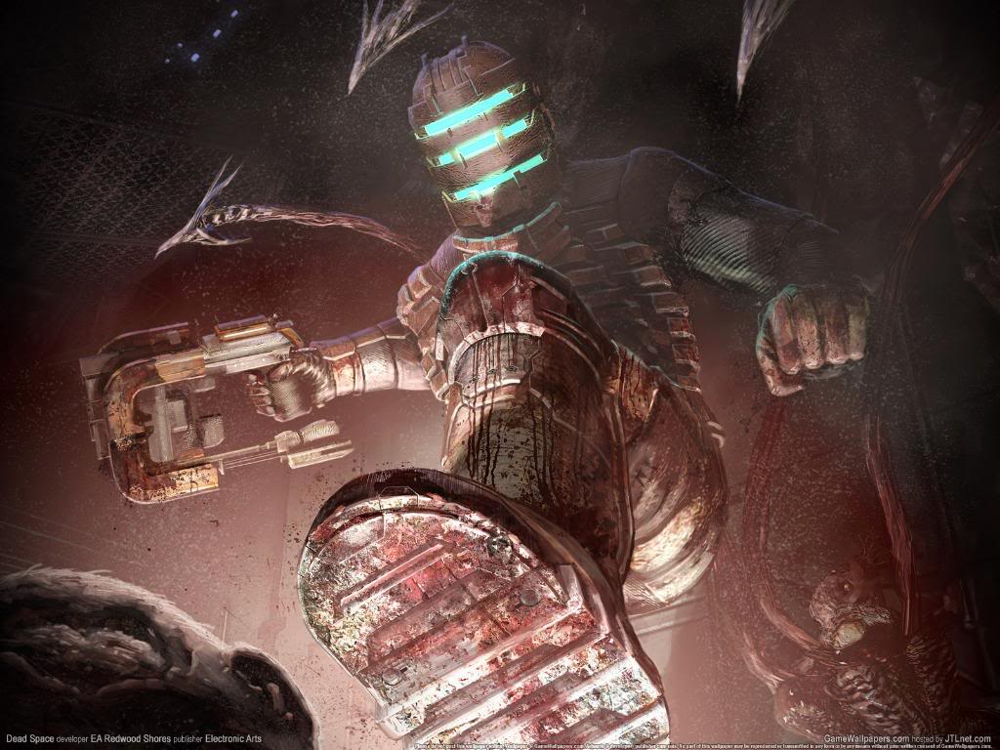

Necromorphs are pretty wonky but they are still fun to kill. Weapons from DS are provided too.

Cmdline for dedicated servers:

```bash
Game=DeadSpaceKFGameType.DeadSpaceKFGameType
```

* Authors - *WPC*
* Links - [Mediafire](<https://www.mediafire.com/download/rzf46moc11rk3wk/DeadSpaceV2.zip>), [Workshop](<https://steamcommunity.com/workshop/filedetails/?id=98337050>), [Forum](<https://forums.tripwireinteractive.com/index.php?threads/dead-space-mod-back-from-the-dead.89700/>), [ModDb](<https://www.moddb.com/mods/kf-dead-space>), [Site (Wayback Machine)](<https://web.archive.org/web/*/http://www.mostimpressive.nl/DeadSpace/>)
* Notes - *Greylisted*


