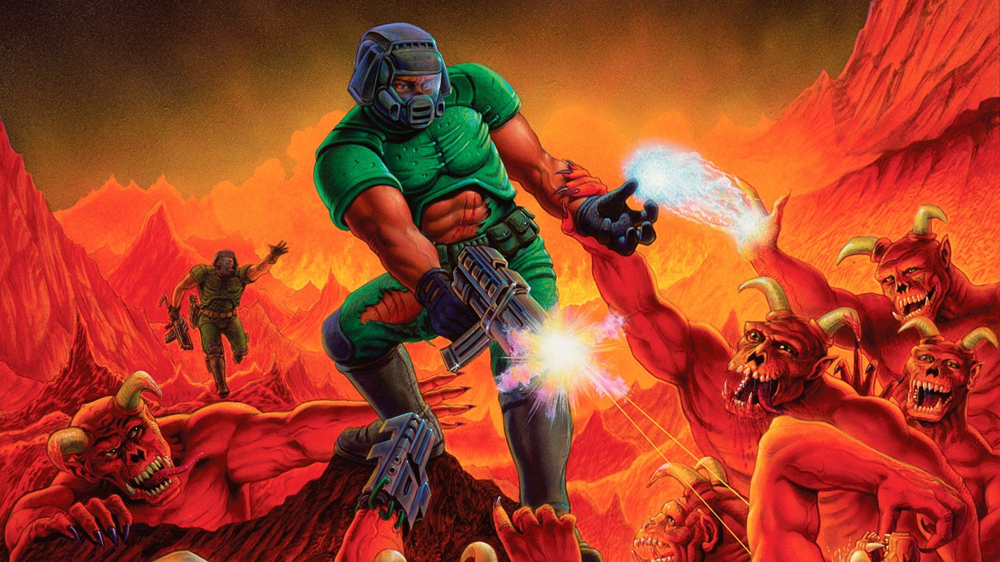
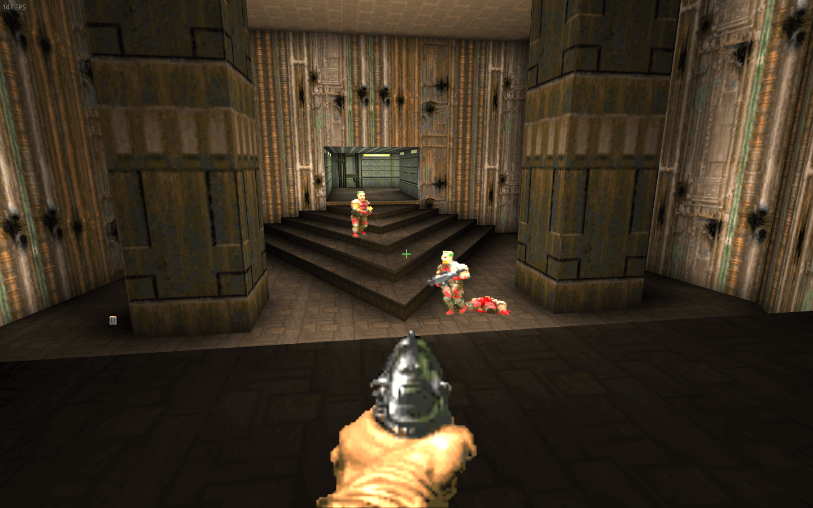
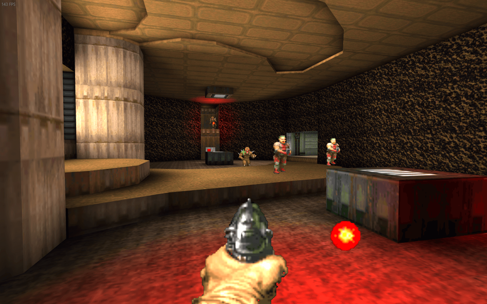
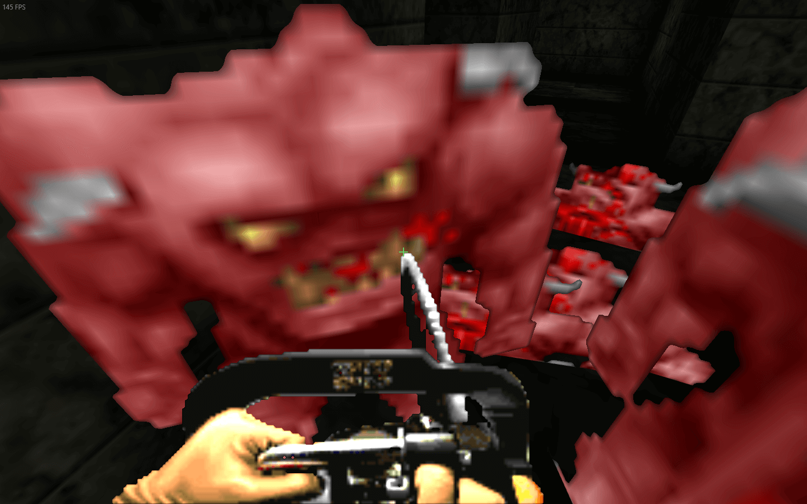

## **Mods**

### Doom I / II Mod

A mod for Doom 1 and 2 weapons to Killing floor (which is based on the one for UT2004 which again is based on one for Unreal 1). In total it contains all monsters and weapons (and couple of items) from the classic Doom. © [*Marco*](./tech/Links.md#Marco)

It comes with 2 mutators:

1. Replace KF monsters with Doom monsters.
2. Replace KF weapons with Doom weapons (initial weapons and shop weapons).

Cmdline for dedicated servers:

```bash
Game=DoomPawnsKF.DoomGameType
```

* Authors - [*Marco*](./tech/Links.md#Marco)
* Links - [Mediafire](<https://www.mediafire.com/file/over08lx7th14wx/DoomPawnsKF.zip/file>), [Workshop](<https://steamcommunity.com/sharedfiles/filedetails/?id=97737990>), [Forum](<https://forums.tripwireinteractive.com/index.php?threads/kf-doom-i-ii.37838/>)

### Doom 3 Mod Beta 4

> Better install [Doom 3 SE](#doom-3-mod-scrn-edition) on top of this - it contains **many** [fixes](https://github.com/poosh/KF-ScrnDoom3#version-history).

* Authors - [*Marco*](./tech/Links.md#Marco)
* Links - [Mediafire](<https://www.mediafire.com/file/r5xzwslbdondt58/Doom3KFBeta4.zip/file>), [Workshop #1](<https://steamcommunity.com/workshop/filedetails/?id=98454734> 'monster pack'), [Workshop #2](<https://steamcommunity.com/workshop/filedetails/?id=98456936> 'textures'), [Forum](<https://forums.tripwireinteractive.com/index.php?threads/kf-doom-iii.52427/>)

### Doom 3 Mod ScRN Edition

* Authors - [*Poosh*](./tech/Links.md#Poosh)
* Links - [Mediafire](<https://www.mediafire.com/file/6b39wqk9om7nszp/ScrnDoom3KF.zip/file>), [Workshop](<https://steamcommunity.com/sharedfiles/filedetails/?id=134455165>), [Github](<https://github.com/poosh/KF-ScrnDoom3>)

## **Doom II Maps**

### Single Player Campaign

* Authors - [*Lethalvortex*](./tech/Links.md#Lethalvortex)
  * KF-BeginDoom.rom
  * KFS-Doom2Map01F.rom *(02, 03 -> 10)*
  * KFS-Doom2Map30F.rom
  * KFS-Doom2Map31F.rom
  * KFS-Doom2Map32F.rom
* Links - [Mediafire](<https://www.mediafire.com/file/3955f9f7zq3vrka/KFDoomCampaign.zip/file>), [Workshop](<https://steamcommunity.com/sharedfiles/filedetails/?id=98248061>)
* Notes - *Greylisted*





### Dragged into Hell

* Authors - [*Lethalvortex*](./tech/Links.md#Lethalvortex)
  * KFS-DraggedintoHell01v2.rom
  * KFS-DraggedintoHell02v2.rom
  * KFS-DraggedintoHell03v2.rom
  * KFS-DraggedintoHell04v2.rom
  * KFS-DraggedintoHell05v1.rom
* Links - [Mediafire](<https://www.mediafire.com/file/4kcyndtkq6tui72/DraggedintoHell.zip/file>), [Workshop](<https://steamcommunity.com/sharedfiles/filedetails/?id=98483655>), [Forum](<https://forums.tripwireinteractive.com/index.php?threads/draggedintohellv1-for-doom-mutator.43225/>)
* Notes - *Greylisted*




