Official deathmatch by TWI, very similar to Battlefield's [gun master](https://battlefield.fandom.com/wiki/Gun_Master) mode - every kill instantly gets you the next weapon in the list. Be the first player to get a kill with every weapon on the list to win!

* Set min and max player counts from cmdline.
* Set your weapon lists in config file.
* Use `admin addbots <desired_number>` command to add bots. They are fun, so try em.

Cmdline for dedicated servers:

```bash
Game=KFGunGame.KFGG?MaxPlayers=32?MinPlayers=8
```

## Gun Game Mod

* Authors - [*Ramm-Jaeger*](./tech/Links.md#Ramm-Jaeger), modified by [*NikC-*](./tech/Links.md#nikc)
* Links - [GitHub](<https://github.com/InsultingPros/KFGunGame/releases>)
* Notes - *Greylisted*

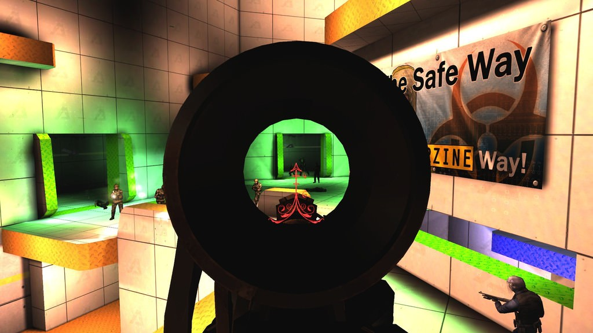

## Original Maps

* Authors - [*Ramm-Jaeger*](./tech/Links.md#Ramm-Jaeger)
  * GG-TR_Bloreen.rom
  * GG-TR_BloreenLowGrav.rom
  * GG-TR_BloreenReduxLowGrav.rom
  * GG-TR_CloseQuarters.rom
  * GG-TR_Stairways.rom
  * GG-VR_Ramps.rom
  * GG-VR_RampsLowGrav.rom
  * GG-VR_Vertical.rom
  * GG-VR_VerticalLowGrav.rom
* Links - [Mediafire](<https://www.mediafire.com/file/nnzsg2eyda64m8d/KFGunGame_Original_Maps.zip/file>)


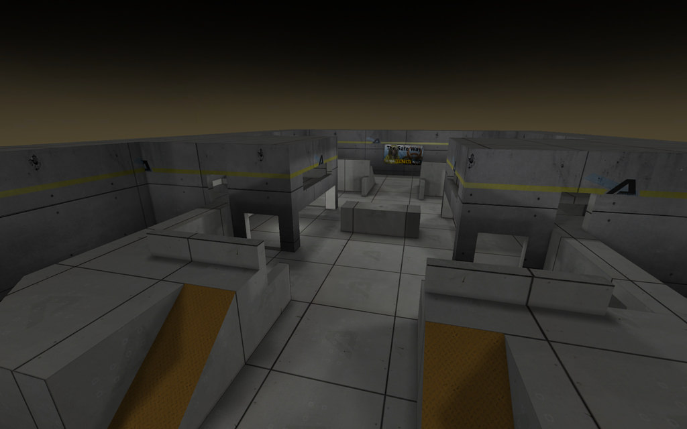
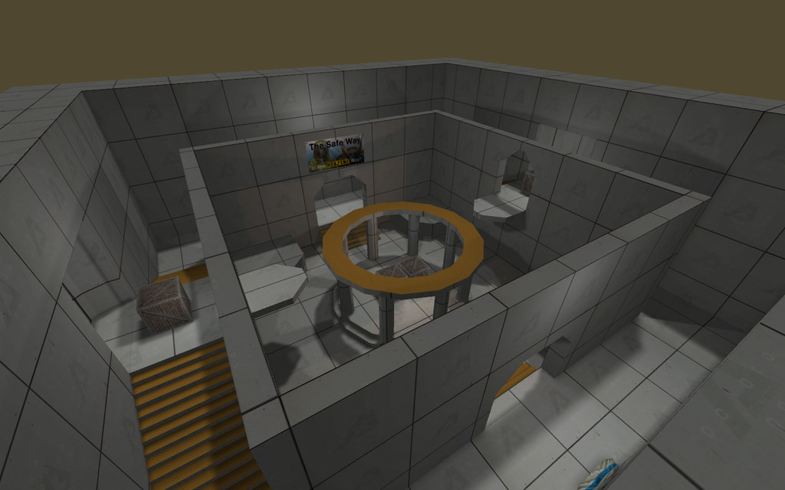


## Space and Watermelons

* Authors - [*no7sag*](./tech/Links.md#no7sag)
* GG-SpaceAndWatermelons.rom
* Links - [Mediafire](<https://www.mediafire.com/file/wy8vgauwf8d4vn4/GG-SpaceAndWatermelons.zip/file>), [Workshop](<https://steamcommunity.com/sharedfiles/filedetails/?id=1322418475>)


## Vortex

* Authors - [*PiX*](./tech/Links.md#PiX)
* GG-Vortex.rom
* Links - [Mediafire](<https://www.mediafire.com/file/bmyfgtfoymow19g/GG-Vortex.zip/file>), [Workshop](<https://steamcommunity.com/sharedfiles/filedetails/?id=237662047>), [Forum](<https://forums.tripwireinteractive.com/index.php?threads/gg-vortex.100740/>)


## Opposing Fronts

* Authors - [*avp2501*](./tech/Links.md#avp2501)
* GG-VR_OpposingFronts.rom
* Links - [Mediafire](<https://www.mediafire.com/file/0i4e5taw7j7rqne/GG-VR_OpposingFronts.zip/file>), [Workshop](<https://steamcommunity.com/sharedfiles/filedetails/?id=101645255>)


## Corridor Tiny

* Authors - [*avp2501*](./tech/Links.md#avp2501)
* GG-VR_Corridor_Tiny.rom
* Links - [Mediafire](<https://www.mediafire.com/file/6wtdpaip88cuk95/GG-VR_Corridor_Tiny.zip/file>), [Workshop](<https://steamcommunity.com/sharedfiles/filedetails/?id=101549771>)

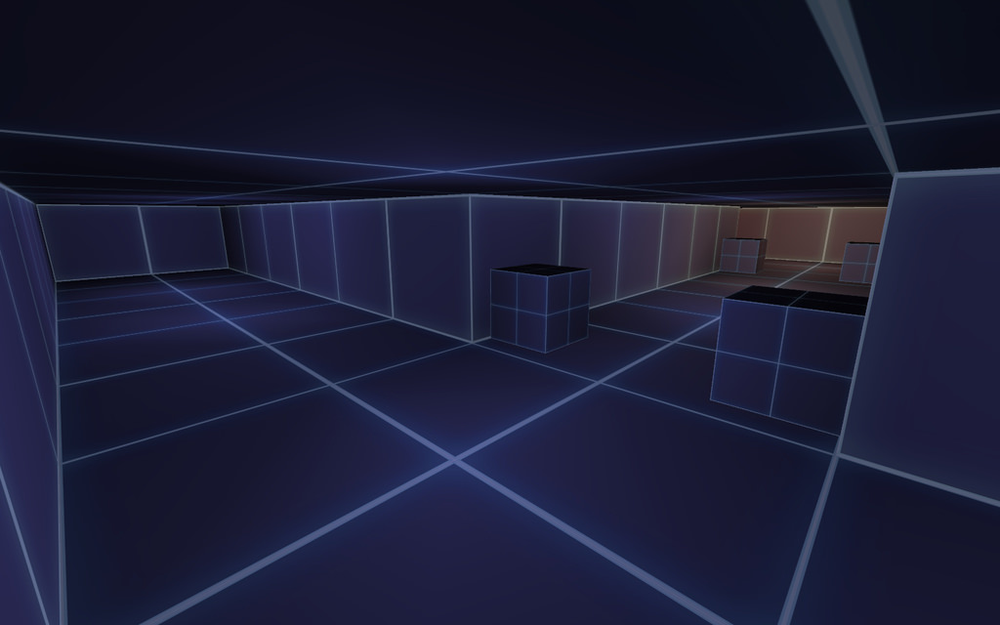

## Multi Story

* Authors - [*avp2501*](./tech/Links.md#avp2501)
* GG-VR_MultiStory.rom
* Links - [Mediafire](<https://www.mediafire.com/file/p75t84w5owj6s4d/GG-VR_MultiStory.zip/file>), [Workshop](<https://steamcommunity.com/sharedfiles/filedetails/?id=102353471>)


## Grid Madness Large

* Authors - [*avp2501*](./tech/Links.md#avp2501)
* GG-VR_GridMadness_Large.rom
* Links - [Mediafire](<https://www.mediafire.com/file/kyq86rsoa7dn8wo/GG-VR_GridMadness_Large.zip/file>), [Workshop](<https://steamcommunity.com/sharedfiles/filedetails/?id=101547928>)


## Grid Madness Tiny

* Authors - [*avp2501*](./tech/Links.md#avp2501)
* GG-VR_GridMadness_Tiny.rom
* Links - [Mediafire](<https://www.mediafire.com/file/tc78aok4bkrwpdo/GG-VR_GridMadness_Tiny.zip/file>), [Workshop](<https://steamcommunity.com/sharedfiles/filedetails/?id=101471084>)


## High Jump

* Authors - *Sunzliot*
* GG-VR_HighJump.rom
* Links - [Mediafire](<https://www.mediafire.com/file/tig928g6d3aun26/GG-VR_HighJump.zip/file>)


## Purplish

* Authors - [*Mr.RoBoT*](./tech/Links.md#Mr.RoBoT)
* GG-Purplish.rom
* Links - [Mediafire](<https://www.mediafire.com/file/tnjvbb3ivq9d92v/GG-Purplish.zip/file>), [Workshop](<https://steamcommunity.com/sharedfiles/filedetails/?id=98049290>), [Forum](<https://forums.tripwireinteractive.com/index.php?threads/gg-purplish.74933/>), [ModDb](<https://www.moddb.com/games/killing-floor/addons/gg-purplish>)

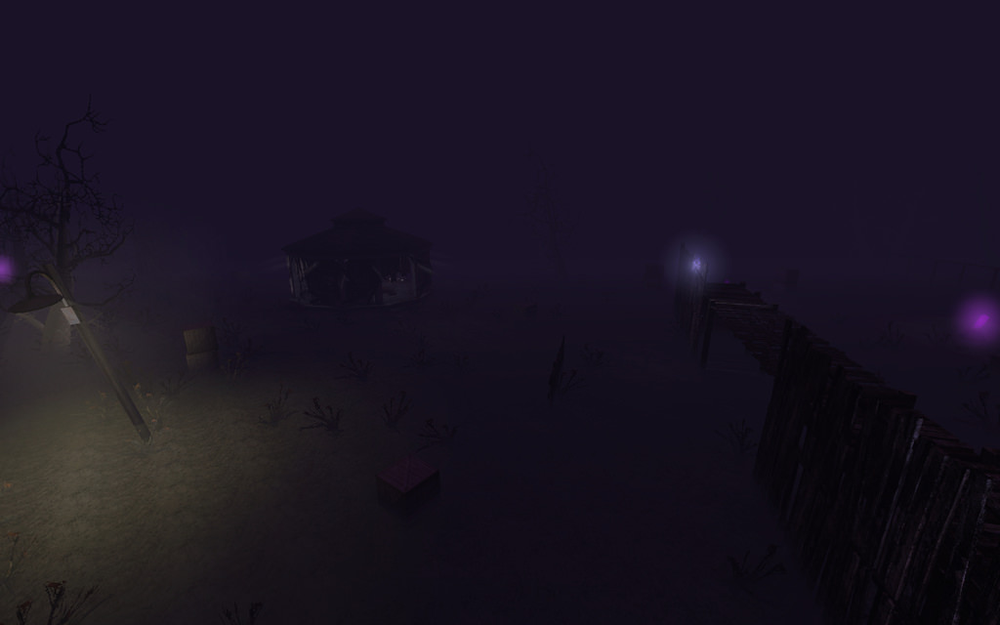

## Street

* Authors - [*Mr.RoBoT*](./tech/Links.md#Mr.RoBoT)
* GG-Streetv2.rom
* Links - [Mediafire](<https://www.mediafire.com/file/bxmm27a0ua4zrm2/GG-Streetv2.zip/file>), [Workshop](<https://steamcommunity.com/sharedfiles/filedetails/?id=98050666>), [Forum](<https://forums.tripwireinteractive.com/index.php?threads/gg-street.74651/>), [ModDb](<https://www.moddb.com/games/killing-floor/addons/gg-streetv2>)


## Camo Time

* Authors - [*Mr.RoBoT*](./tech/Links.md#Mr.RoBoT)
* GG-CamoTime.rom
* Links - [Mediafire](<https://www.mediafire.com/file/zw0faimt8a8g2ch/GG-CamoTime.zip/file>), [Workshop](<https://steamcommunity.com/sharedfiles/filedetails/?id=98048459>), [Forum](<https://forums.tripwireinteractive.com/index.php?threads/gg-camotime.75365/>), [ModDb](<https://www.moddb.com/games/killing-floor/addons/gg-camotime>)

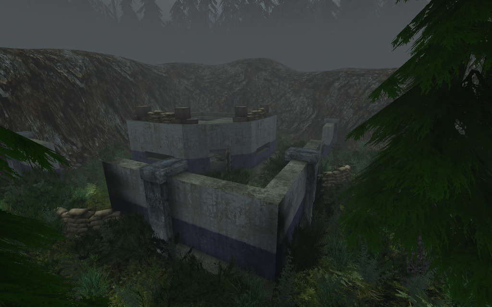

## 1Fort

* Authors - [*Beasty*](./tech/Links.md#Smiff)
* GG-1Fort.rom
* Links - [Mediafire](<https://www.mediafire.com/file/bbk8mf9ku588bde/GG-1Fort.zip/file>)

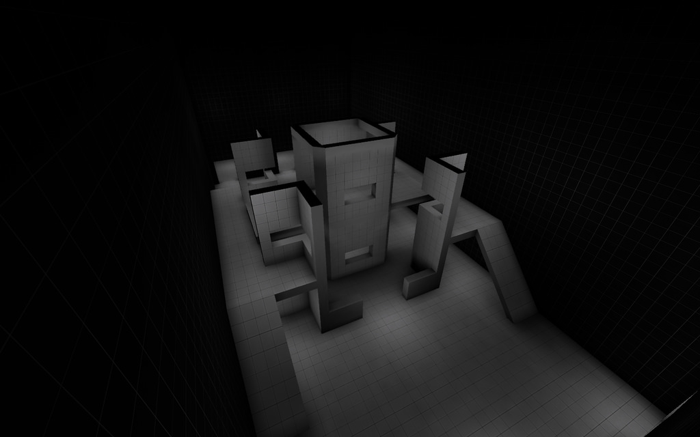

## Siamese Towers

* Authors - [*Beasty*](./tech/Links.md#Smiff)
* GG-SiameseTowersLowGrav.rom
* Links - [Mediafire](<https://www.mediafire.com/file/k9eac85wce1n0ok/GG-SiameseTowersLowGrav.zip/file>)

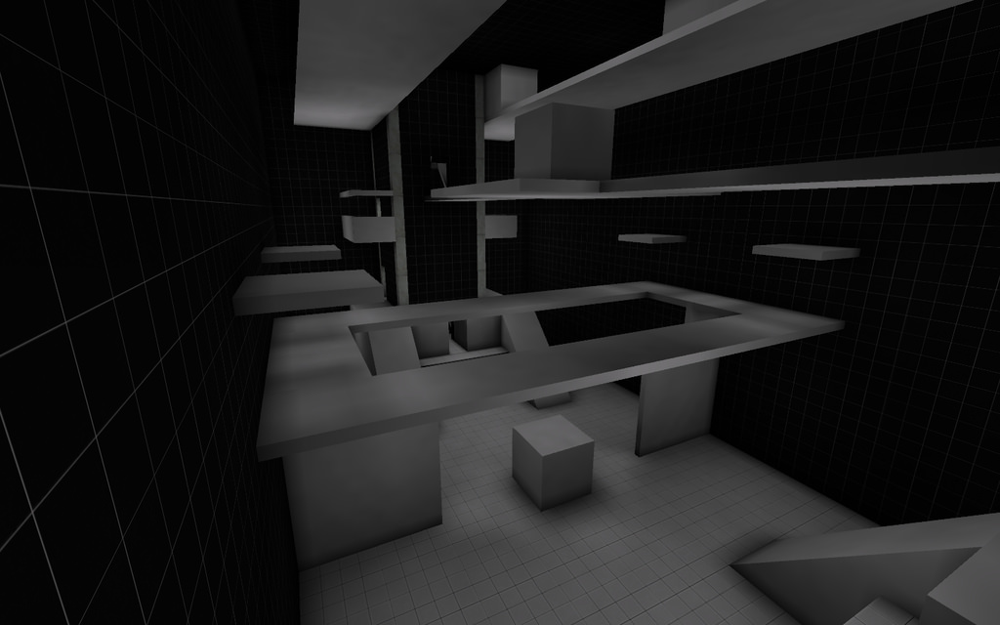

## Block Party

* Authors - [*Fel*](./tech/Links.md#Fel)
* GG-BlockParty.rom
* Links - [Mediafire](<https://www.mediafire.com/file/d7ydmofbm6dmjj3/GG-BlockParty.zip/file>), [Forum](<https://forums.tripwireinteractive.com/index.php?threads/gg-blockparty.75367/>)

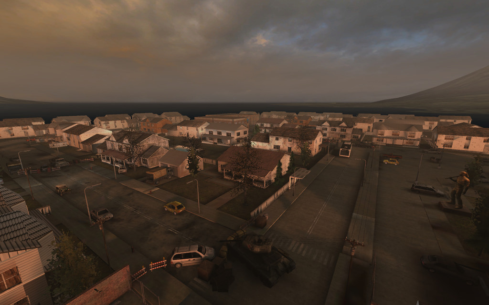

## Laser Room

* Authors - [*Bangulo*](./tech/Links.md#Bangulo)
* GG-LaserRoomV1.rom
* Links - [Mediafire](<https://www.mediafire.com/file/tgm8uukvm1yogdi/GG-LaserRoomV1.zip/file>), [Forum](<https://forums.tripwireinteractive.com/index.php?threads/gg-laserroom.77187/>)


## CS Office

* Authors - *Lone Greeble*
* GG-Office.rom
* Links - [Mediafire](<https://www.mediafire.com/file/cexicra7zr90s14/GG-Office.zip/file>)


## Deck16

* Authors - [*BartBear*](./tech/Links.md#BartBear)
* GG-Deck16.rom
* Links - [Mediafire](<https://www.mediafire.com/file/dktdsb1n5aigqed/GG-Deck16.zip/file>)


## Pasas Small Arena

* Authors - [*BartBear*](./tech/Links.md#BartBear)
* GG-Pasas_small_arena_b1.rom
* Links - [Mediafire](<https://www.mediafire.com/file/e67c5e27c73rboy/GG-Pasas_small_arena_b1.zip/file>)

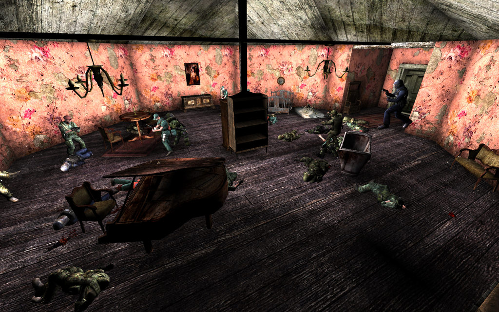

## Snow

* Authors - [*UltraK!11*](./tech/Links.md#UltraK!11)
* GG-Snow[UltraMapping].rom
* Links - [Mediafire](<https://www.mediafire.com/file/vu719cuyp858g26/GG-Snow%5BUltraMapping%5D.zip/file>), [Workshop](<https://steamcommunity.com/sharedfiles/filedetails/?id=305788271>), [Forum (Wayback Machine)](<https://web.archive.org/web/*/http://killingfloor.ru/xforum/threads/gg-snow-ultramapping.3929/>)


## Shank

* Authors - [*UltraK!11*](./tech/Links.md#UltraK!11)
* GG-Shank[UltraMapping].rom
* Links - [Mediafire](<https://www.mediafire.com/file/sd43hwkav6rznxz/GG-Shank%255BUltraMapping%255D.zip/file>), [Forum (Wayback Machine)](<https://web.archive.org/web/*/http://killingfloor.ru/xforum/threads/gg-shank.2876/>)


## Fatal Instinct

* Authors - [*UltraK!11*](./tech/Links.md#UltraK!11)
* GG-FatalInstinct[UltraMapping].rom
* Links - [Mediafire](<https://www.mediafire.com/file/77kibhj5ul3c583/GG-FatalInstinct%5BUltraMapping%5D.zip/file>), [Forum (Wayback Machine)](<https://web.archive.org/web/*//xforum/threads/gg-fatal-instinct.2910/>)

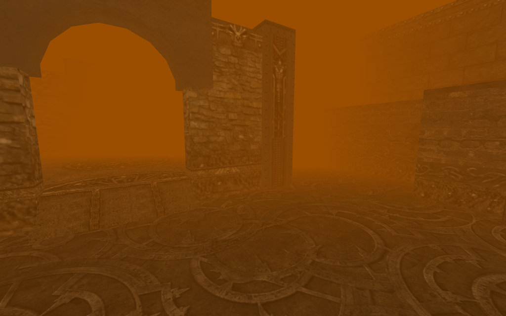

## Survive this Bitch

* Authors - [*GunsForBucks*](./tech/Links.md#GunsForBucks)
* GG-SurviveThisB_V01_ws.rom
* Links - [Mediafire](<https://www.mediafire.com/file/9edpdhd67pl22v0/GG-SurviveThisB_V01_ws.zip/file>), [Workshop](<https://steamcommunity.com/sharedfiles/filedetails/?id=339984507>)


## Survive this Bitch Low Gravity

* Authors - [*GunsForBucks*](./tech/Links.md#GunsForBucks)
* GG-SurviveThisB_LG_ws.rom
* Links - [Mediafire](<https://www.mediafire.com/file/9ei4h4848zr0em9/GG-SurviveThisB_LG_ws.zip/file>), [Workshop](<https://steamcommunity.com/sharedfiles/filedetails/?id=368017984>)

## Zed County

* Authors - [*GunsForBucks*](./tech/Links.md#GunsForBucks)
* GG-Zed_County_Final_ws.rom
* Links - [Mediafire](<https://www.mediafire.com/file/9qidt2t73okady5/GG-Zed_County_Final_ws.zip/file>), [Workshop](<https://steamcommunity.com/sharedfiles/filedetails/?id=367768575>)

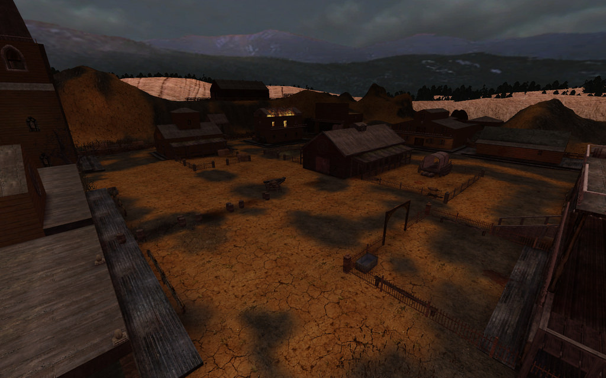

## Zed County Low Gravity

* Authors - [*GunsForBucks*](./tech/Links.md#GunsForBucks)
* GG-Zed_County_LG_Final_ws.rom
* Links - [Mediafire](<https://www.mediafire.com/file/o3zf6e4o9eoekus/GG-Zed_County_LG_Final_ws.zip/file>), [Workshop](<https://steamcommunity.com/sharedfiles/filedetails/?id=367775367>)

## Uptime Funk

* Authors - [*Davidosski*](./tech/Links.md#Davidosski)
* GG-Uptime_Funk.rom
* Links - [Mediafire](<https://www.mediafire.com/file/68vnelorzzmgnuf/GG-Uptime_Funk.zip/file>), [Workshop](<https://steamcommunity.com/sharedfiles/filedetails/?id=2385064757>)


## Platform

* Authors - [*Mastrocoltello*](./tech/Links.md#Mastrocoltello)
* GG-Platform.rom
* Links - [Mediafire](<https://www.mediafire.com/file/bz69kwid0rjfi8p/GG-Platform.zip/file>)

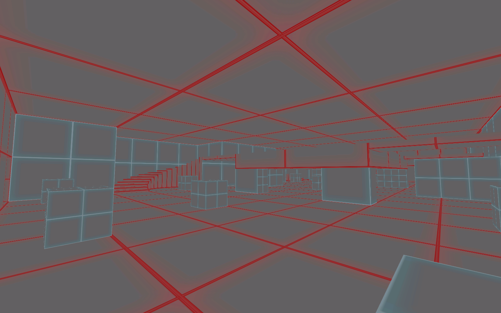

## Platform Low Gravity

* Authors - [*Mastrocoltello*](./tech/Links.md#Mastrocoltello)
* GG-Platform_Low_Grav.rom
* Links - [Mediafire](<https://www.mediafire.com/file/jiy962x203wkthn/GG-Platform_Low_Grav.zip/file>)

## Aftermath

* Authors - *UNKNOWN*
* GG-TR_Aftermath.rom
* Links - [Mediafire](<https://www.mediafire.com/file/2djo6ufma2bqzg9/GG-TR_Aftermath.zip/file>)


## Encruzilhada

* Authors - *UNKNOWN*
* GG-Encruzilhada.rom
* Links - [Mediafire](<https://www.mediafire.com/file/1n415gjxi2yvgqb/GG-Encruzilhada.zip/file>)

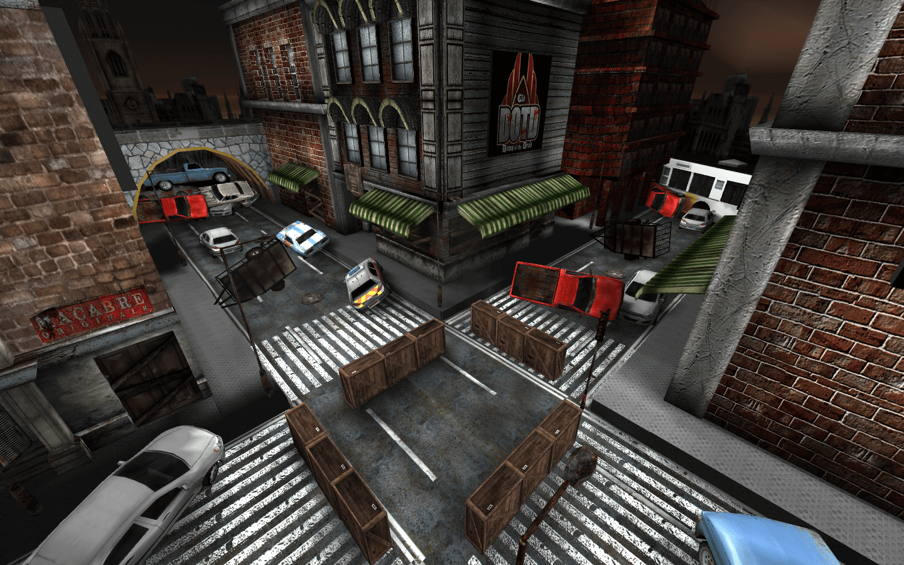

## Noshahr Canals

* Authors - *UNKNOWN*
* GG-NoshahrCanals.rom
* Links - [Mediafire](<https://www.mediafire.com/file/7s2342owtewfnap/GG-NoshahrCanals.zip/file>)


## Octogono

* Authors - *UNKNOWN*
* GG-Octogono.rom
* Links - [Mediafire](<https://www.mediafire.com/file/scbqssnw4l7yxr0/GG-Octogono.zip/file>)

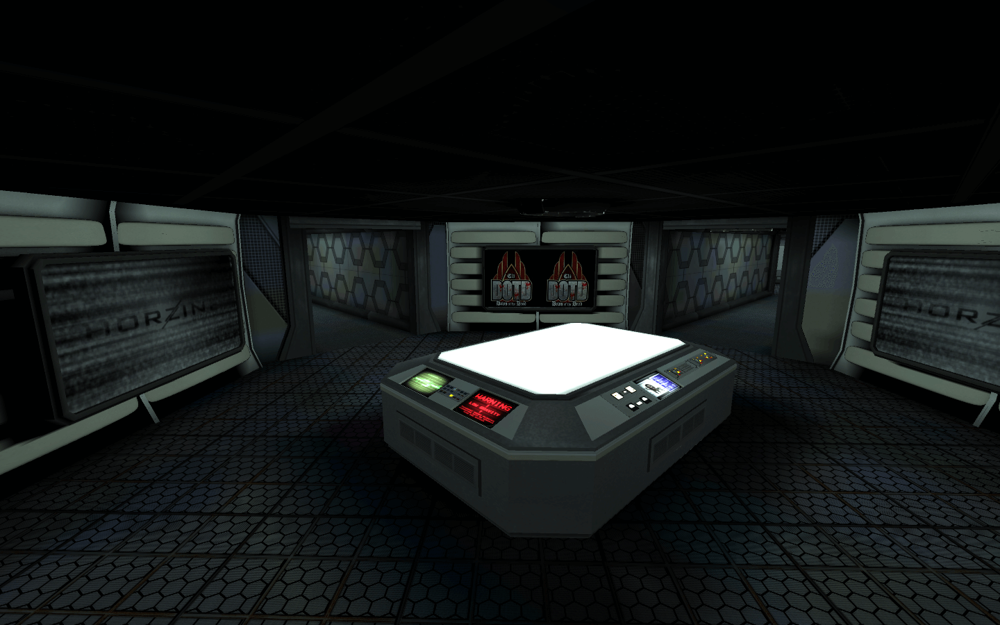

## Hangar

* Authors - *UNKNOWN*
* GG-Hangar.rom
* Links - [Mediafire](<https://www.mediafire.com/file/8tqzf1uhbdaicf4/GG-Hangar.zip/file>)


## Nova Deli

* Authors - *Symec* & [*rain962*](./tech/Links.md#rain962)
* GG-NovaDeli.rom
* Links - [Mediafire](<https://www.mediafire.com/file/13rgsofgu00dpug/GG-NovaDeli.zip/file>)


## Security Floor

* Authors - *UNKNOWN*
* GG-SecurityFloorB1.rom
* Links - [Mediafire](<https://www.mediafire.com/file/uptap8j8pkroxon/GG-SecurityFloorB1.zip/file>)


## Ponte

* Authors - *UNKNOWN*
* GG-Ponte.rom
* Links - [Mediafire](<https://www.mediafire.com/file/ph49exuzgi44hur/GG-Ponte.zip/file>)


## High Rise

* Authors - *UNKNOWN*
* GG-HighRise.rom
* Links - [Mediafire](<https://www.mediafire.com/file/ienjlzuakv0eef0/GG-HighRise.zip/file>)


## Swamp

* Authors - [*Kyben*](./tech/Links.md#Kyben) & *Maul*
* GG-Swamp.rom
* Links - [Mediafire](<https://www.mediafire.com/file/jabws4zfmiqd22n/GG-Swamp.zip/file>)


## Dust 2

* Authors - *Equinox*
* GG-Dust2.rom
* Links - [Mediafire](<https://www.mediafire.com/file/crtimt0bevtxo9f/GG-Dust2.zip/file>)

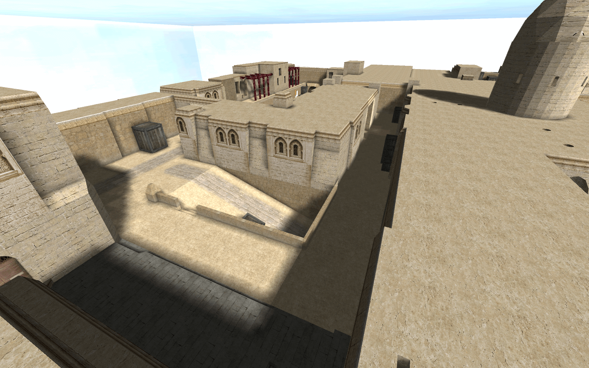

## Favela

* Authors - [*BeastFiend*](./tech/Links.md#Smiff)
* GG-Favela.rom
* Links - [Mediafire](<https://www.mediafire.com/file/9hk0e8ip1urinif/GG-Favela.zip/file>)


## Arcade Laboratory

* Authors - [*kingshinobi*](./tech/Links.md#kingshinobi)
* GG-Arcade-Laboratory.rom
* Links - [Mediafire](<https://www.mediafire.com/file/kgkga976ozwbn4n/GG-Arcade-Laboratory.zip/file>)


## Battlefield 3 Metro

* Authors - *UNKNOWN*
* GG-BF3metro.rom
* Links - [Mediafire](<https://www.mediafire.com/file/iwbsmd63ajf24k2/GG-BF3metro.zip/file>)


## Combat

* Authors - *UNKNOWN*
* GG-Combat.rom
* Links - [Mediafire](<https://www.mediafire.com/file/zlsghjub29m8jjn/GG-Combat.zip/file>)


