> Maps that are converted from [Story mode](./KFMode.md) will be only in this section. To keep it simple and clean.

Official Objective mode by TWI. It grew up from [*Alex Quick*](./tech/Links.md#KF_Alex)'s [modification](<https://forums.tripwireinteractive.com/index.php?threads/story-mode-gametype.79469/>) that exclusively aimed to power story driven maps.

Cmdline for dedicated servers:

```java
Game=KFStoryGame.KFStoryGameInfo
```

## Peak

* Authors - [*Fel*](./tech/Links.md#Fel)
* KFO-Peak.rom
* Links - [Mediafire](<https://www.mediafire.com/file/pgr1140rqw80687/KFO-Peak.zip/file>), [Workshop](<https://steamcommunity.com/sharedfiles/filedetails/?id=189074614>), [Forum](<https://forums.tripwireinteractive.com/index.php?threads/kfo-peak-haloween-map.98150/>)


## Once Upon A Time In Mexico

* Authors - [*Fel*](./tech/Links.md#Fel)
* KFO-OnceUponATimeInMexico.rom
* Links - [Mediafire](<https://www.mediafire.com/file/328n3qa4n2upxbu/KFO-OnceUponATimeInMexico.zip/file>), [Workshop](<https://steamcommunity.com/sharedfiles/filedetails/?id=190214076>), [Forum](<https://forums.tripwireinteractive.com/index.php?threads/kfo-ouatim-beta.95804/>)


## Road To Perdition (KFO)

* Authors - [*Braindawg*](./tech/Links.md#Braindawg), [*S281*](./tech/Links.md#S281) & [*Fel*](./tech/Links.md#Fel)
* KFO-RoadToPerdition.rom
* Links = [Workshop](<https://steamcommunity.com/sharedfiles/filedetails/?id=3468932466>), [GDrive](<https://drive.google.com/file/d/1xJRCyYpZGDMMRyJFNxKL-v0sw88TU-D_/view>), [Mediafire Mirror](<https://www.mediafire.com/file/mpiccy4uv6j1ddn/KFO-RoadToPerdition.zip/file>)

## Resident Evil 1 Mansion

* Authors - [*Driftwood*](./tech/Links.md#Driftwood)
* KFO-RE1-Mansion-V4.rom
* Links - [Mediafire](<https://www.mediafire.com/file/lxb2c33al5091io/KFO-RE1-Mansion-V4.zip/file>), [Workshop](<https://steamcommunity.com/sharedfiles/filedetails/?id=399639299>), [Forum](<https://forums.tripwireinteractive.com/index.php?threads/resident-evil-1-mansion-story-mission-final.44508/>)

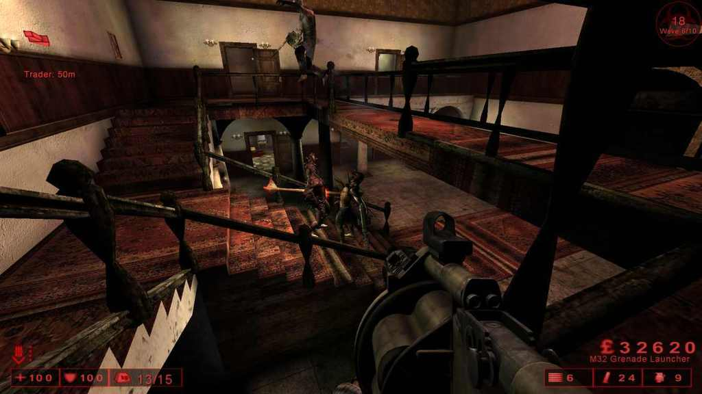

## Haunted Hotel

* Authors - [*Mr.RoBoT*](./tech/Links.md#Mr.RoBoT) & [*Marco*](./tech/Links.md#Marco)
* KFO-Haunted-Hotel.rom
* Links - [Mediafire](<https://www.mediafire.com/file/get97w6j877az2m/KFO-Haunted-Hotel.zip/file>), [Workshop](<https://steamcommunity.com/sharedfiles/filedetails/?id=188440184>), [Forum](<https://forums.tripwireinteractive.com/index.php?threads/kfo-haunted-hotel.98304/>), [ModDb](<https://www.moddb.com/games/killing-floor/addons/kfo-haunted-hotel>)
* Notes - *Greylisted*


## Snuff (Solo)

* Authors - [*Alex Quick*](./tech/Links.md#KF_Alex)
* KFO-SnuffMonkey.rom
* Links - [Mediafire](<https://www.mediafire.com/file/i4hchfya3d7a5zk/KFO-SnuffMonkey.zip/file>), [Workshop](<https://steamcommunity.com/sharedfiles/filedetails/?id=171724782>), [Forum](<https://forums.tripwireinteractive.com/index.php?threads/kfo-snuff.97442/>)
* Notes - *Greylisted*

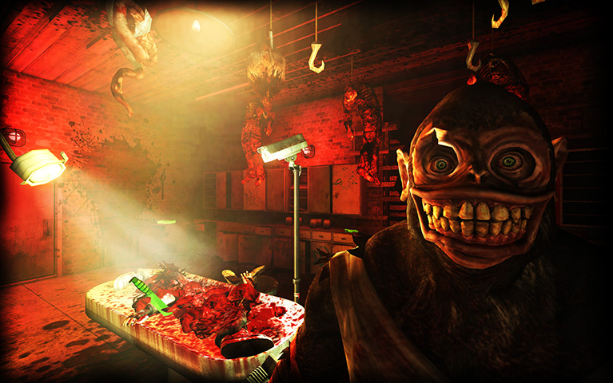


## Endless Map Pack

* Authors - [*oiruka101*](./tech/Links.md#oiruka101)
  * KFO-BioticsLab-challenge-endless.rom
  * KFO-Biohazard-challenge-endless.rom
  * KFO-EvilSantasLair-challenge-endless.rom
* Links - [Mediafire](<https://www.mediafire.com/file/og1qs9ozliwlshw/Endless+Map+Pack.zip/file>), [Workshop](<https://steamcommunity.com/sharedfiles/filedetails/?id=186611598>)


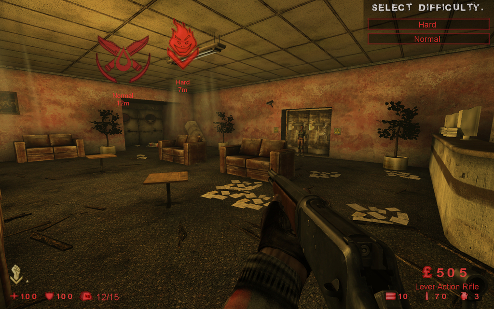
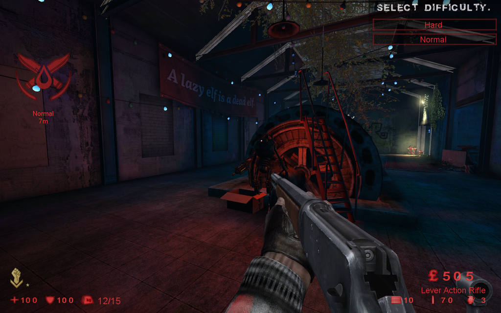

## Hive Silent Hill

* Authors - [*Crondog8*](./tech/Links.md#Crondog8)
* KFO-Hive-SilentHill_v1_0.rom
* Links - [Mediafire](<https://www.mediafire.com/file/f9dn6m3g84aa3qe/KFO-Hive-SilentHill_v1_0.zip/file>), [Workshop](<https://steamcommunity.com/sharedfiles/filedetails/?id=1412850520>)

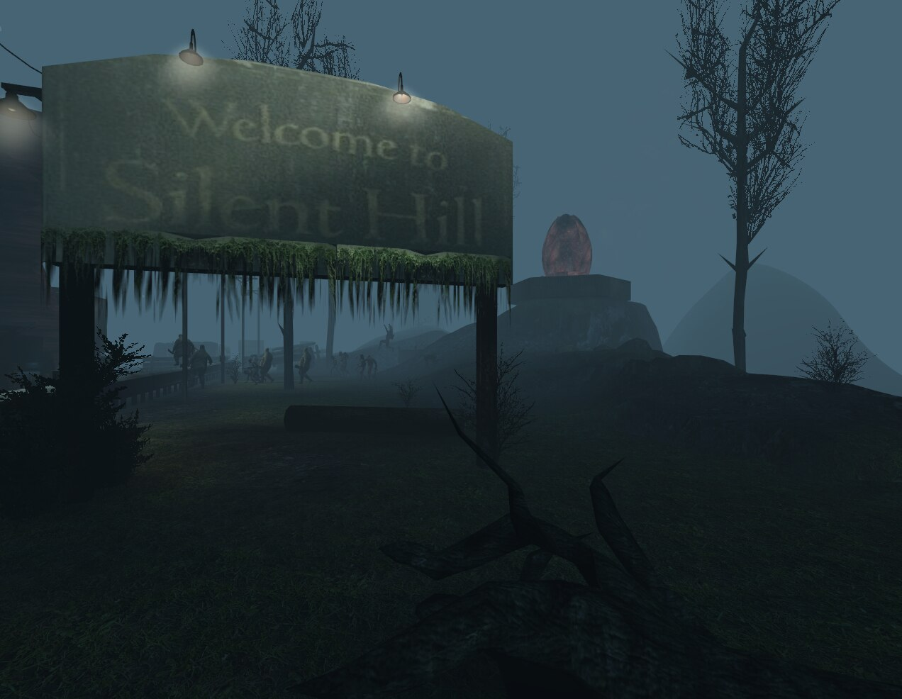

## Foundry

* Authors - [*Poosh*](./tech/Links.md#Poosh)
* KFO-Foundry-SE.rom
* Links - [Mediafire](<https://www.mediafire.com/file/nyd4930lbs2bcek/KFO-Foundry-SE.zip/file>), [Workshop](<https://steamcommunity.com/sharedfiles/filedetails/?id=207486983>), [Forum](<https://forums.tripwireinteractive.com/index.php?threads/kfo-foundry-se-scrn-edition.99499/>)


## Station

* Authors - [*HIUFIGYO*](./tech/Links.md#HIUFIGYO)
* KFO-Stationv1-2.rom
* Links - [Mediafire](<https://www.mediafire.com/file/4jjtxjqmb466ji6/KFO-Stationv1-2.zip/file>), [Workshop](<https://steamcommunity.com/sharedfiles/filedetails/?id=222972534>)


## Filth's Cross

* Authors - [*The_Hunter*](./tech/Links.md#The_Hunter)
* KFO-FilthsCross.rom
* Links - [Mediafire](<https://www.mediafire.com/file/gj0g9isvwt23g09/KFO-FilthsCross.zip/file>)


## West London v1.3

* Authors - [*The_Hunter*](./tech/Links.md#The_Hunter)
* KFO-WestLondon-FE.rom
* Links - [Mediafire](<https://www.mediafire.com/file/q7bbl7doseds5n5/KFO-WestLondon-FE.zip/file>), [Workshop](<https://steamcommunity.com/sharedfiles/filedetails/?id=254449534>), [Forum](<https://forums.tripwireinteractive.com/index.php?threads/kfo-westlondon.100585/>)


## West London Survival

* Authors - [*The_Hunter*](./tech/Links.md#The_Hunter)
* KFO-WestLondon-Survival.rom
* Links - [Mediafire](<https://www.mediafire.com/file/u0ije5l1ofqceox/KFO-WestLondon-Survival.zip/file>), [Workshop](<https://steamcommunity.com/sharedfiles/filedetails/?id=264566391>)


## Biotics Lab Survival

* Authors - [*The_Hunter*](./tech/Links.md#The_Hunter)
* KFO-[Survival]-BioticsLab.rom
* Links - [Mediafire](<https://www.mediafire.com/file/pab53zv1fx7d5ks/KFO-%5BSurvival%5D-BioticsLab.zip/file>), [Workshop](<https://steamcommunity.com/sharedfiles/filedetails/?id=289213740>)


## Manor Survival

* Authors - [*The_Hunter*](./tech/Links.md#The_Hunter)
* KFO-[Survival]-Manor.rom
* Links - [Mediafire](<https://www.mediafire.com/file/8n30ecg0d829113/KFO-%5BSurvival%5D-Manor.zip/file>), [Workshop](<https://steamcommunity.com/sharedfiles/filedetails/?id=322218109>)


## Manor Defence

* Authors - [*Cakedog*](./tech/Links.md#Cakedog)
* KFO-ManorDefence.rom
* Links - [Mediafire](<https://www.mediafire.com/file/d4195j4qa1b55fm/KFO-ManorDefence.zip/file>), [Workshop](<https://steamcommunity.com/sharedfiles/filedetails/?id=299954443>)

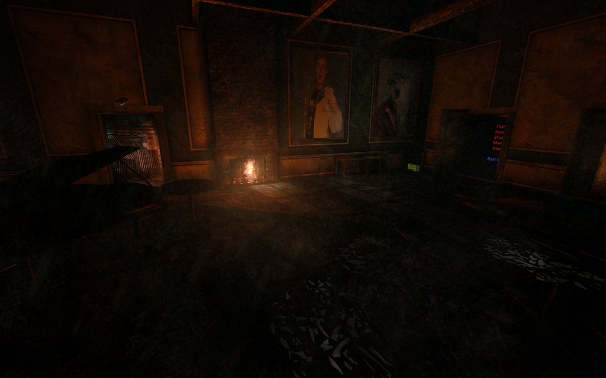


## Boss Arena

* Authors - [*Fire*](./tech/Links.md#Fire)
* KFO-BossArena.rom
* Links - [Mediafire](<https://www.mediafire.com/file/c1b879126qzabpo/KFO-BossArena.zip/file>), [Forum](<https://forums.tripwireinteractive.com/index.php?threads/kfo-bossarena.103455/>)


## Boss Arena Nerf

* Authors - [*Holy Username Batman!*](./tech/Links.md#Batman) & [*NikC-*](./tech/Links.md#nikc)
* KFO-BossArenaNerf.rom
* Links - [Mediafire](<https://www.mediafire.com/file/p9wxdv7xckgifpj/KFO-BossArenaNerf.zip/file>), [Workshop](<https://steamcommunity.com/sharedfiles/filedetails/?id=2318348544>)


## Boss Arena Unlimited Dosh

* Authors - [*SveN*](./tech/Links.md#SveN)
* KFO-BossArenaUnlimitedDosh.rom
* Links - [Mediafire](<https://www.mediafire.com/file/509eqcqsdjrcls3/KFO-BossArenaUnlimitedDosh.zip/file>), [Workshop](<https://steamcommunity.com/sharedfiles/filedetails/?id=844040753>)

## Planetary Battlegrounds Z

* Authors - [*GunsForBucks*](./tech/Links.md#GunsForBucks)
* KFO-PlanetaryBattlegroundsZ_Beta01_ws.rom
* Links - [Mediafire](<https://www.mediafire.com/file/ddy19sf7vlqocw1/KFO-PlanetaryBattlegroundsZ_Beta01_ws.zip/file>), [Workshop](<https://steamcommunity.com/sharedfiles/filedetails/?id=354970200>), [Forum](<https://forums.tripwireinteractive.com/index.php?threads/kfo-planetary-battlegrounds-z.105189/>)

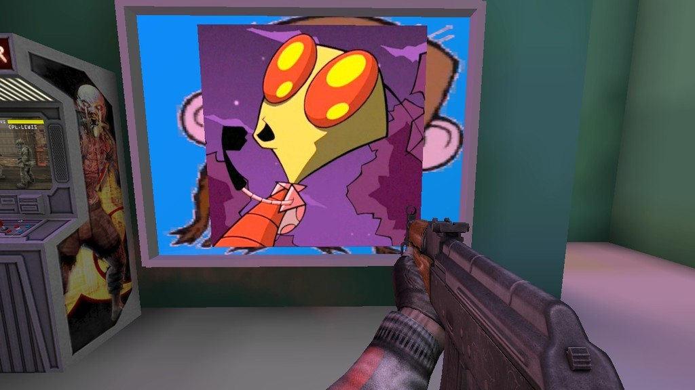

## Soylent Zed

* Authors - [*GunsForBucks*](./tech/Links.md#GunsForBucks)
* KFO-SoylentZed_multiplayer_Final_ws.rom
* Links - [Mediafire](<https://www.mediafire.com/file/z1l4fbxt4vm2eq1/KFO-SoylentZed_multiplayer_Final_ws.zip/file>), [Workshop](<https://steamcommunity.com/sharedfiles/filedetails/?id=253942341>), [Forum](<https://forums.tripwireinteractive.com/index.php?threads/kfo-soylent-zed.101474/>)


## Soylent Zed (Solo)

* Authors - [*GunsForBucks*](./tech/Links.md#GunsForBucks)
* KFO-SoylentZed_Final_Solo_ws.rom
* Links - [Mediafire](<https://www.mediafire.com/file/2454898q4e2ne1o/KFO-SoylentZed_Final_Solo_ws.zip/file>), [Workshop](<https://steamcommunity.com/sharedfiles/filedetails/?id=515857446>)

## **Fleshpound Challenge**

* Authors - [*GunsForBucks*](./tech/Links.md#GunsForBucks)

Будут появляться только фп. Имейте в виду, что система агра как в старых версиях KF.


### Biotics Lab FPC

* KFO-FPChallenge_BioticsLab_V00_WS.rom
* Links - [Mediafire](<https://www.mediafire.com/file/a3rsx4uxp5d62vw/KFO-FPChallenge_BioticsLab_V00_WS.zip/file>), [Workshop](<https://steamcommunity.com/sharedfiles/filedetails/?id=259447743>)

### Departed FPC

* KFO-FPC_Departed_V00_WS.rom
* Links - [Mediafire](<https://www.mediafire.com/file/c9da7s88ckizwgw/KFO-FPC_Departed_V00_WS.zip/file>), [Workshop](<https://steamcommunity.com/sharedfiles/filedetails/?id=259770076>)

### Fright Yard FPC

* KFO-FPChallenge_FrightYard_V00_WS.rom
* Links - [Mediafire](<https://www.mediafire.com/file/ce9z2dijgb6r6dd/KFO-FPChallenge_FrightYard_V00_WS.zip/file>), [Workshop](<https://steamcommunity.com/sharedfiles/filedetails/?id=259310079>), [Forum](<https://forums.tripwireinteractive.com/index.php?threads/kfo-fp-challenge-frightyard.101835/>)

### Ice Breaker FPC

* KFO-FPC_Icebreaker.rom
* Links - [Mediafire](<https://www.mediafire.com/file/cvy7aaospyd3o7x/KFO-FPC_Icebreaker.zip/file>), [Workshop](<https://steamcommunity.com/sharedfiles/filedetails/?id=673350154>)

### Moonbase FPC

* KFO-FPC-MoonBase_V00_WS.rom
* Links - [Mediafire](<https://www.mediafire.com/file/zkpzrppxn7ejkwa/KFO-FPC-MoonBase_V00_WS.zip/file>), [Workshop](<https://steamcommunity.com/sharedfiles/filedetails/?id=259730854>)

### Moonbase Sirens vs Husks FPC

* KFO-HuskVsSiren-MoonBase_V00-WS.rom
* Links - [Mediafire](<https://www.mediafire.com/file/2hvqsfssi9d7vmm/KFO-HuskVsSiren-MoonBase_V00-WS.zip/file>), [Workshop](<https://steamcommunity.com/sharedfiles/filedetails/?id=264529260>)

### Sibyl Complex FPC

* KFO-FP_Challenge_SibylComplex_BetaV00_WS.rom
* Links - [Mediafire](<https://www.mediafire.com/file/0646lo4cuztwvot/KFO-FP_Challenge_SibylComplex_BetaV00_WS.zip/file>), [Workshop](<https://steamcommunity.com/sharedfiles/filedetails/?id=258378699>), [Forum](<https://forums.tripwireinteractive.com/index.php?threads/kfo-fp-challenge-sibyl-complex.101756/>)

### West London FPC

* KFO-FPChallenge_WestLondon_V00_WS.rom
* Links - [Mediafire](<https://www.mediafire.com/file/c6w4n2m53e019q2/KFO-FPChallenge_WestLondon_V00_WS.zip/file>), [Workshop](<https://steamcommunity.com/sharedfiles/filedetails/?id=259585957>)

### Wyre FPC

* KFO-FPC_Wyre_ws.rom
* Links - [Mediafire](<https://www.mediafire.com/file/g8n644eqg89663n/KFO-FPC_Wyre_ws.zip/file>), [Workshop](<https://steamcommunity.com/sharedfiles/filedetails/?id=359680054>)

## **30 wave challenge**

* Authors - [*HIUFIGYO*](./tech/Links.md#HIUFIGYO)

Для любителей хардкора и длинных игр. На каждые 10 волн +1 патриарх.

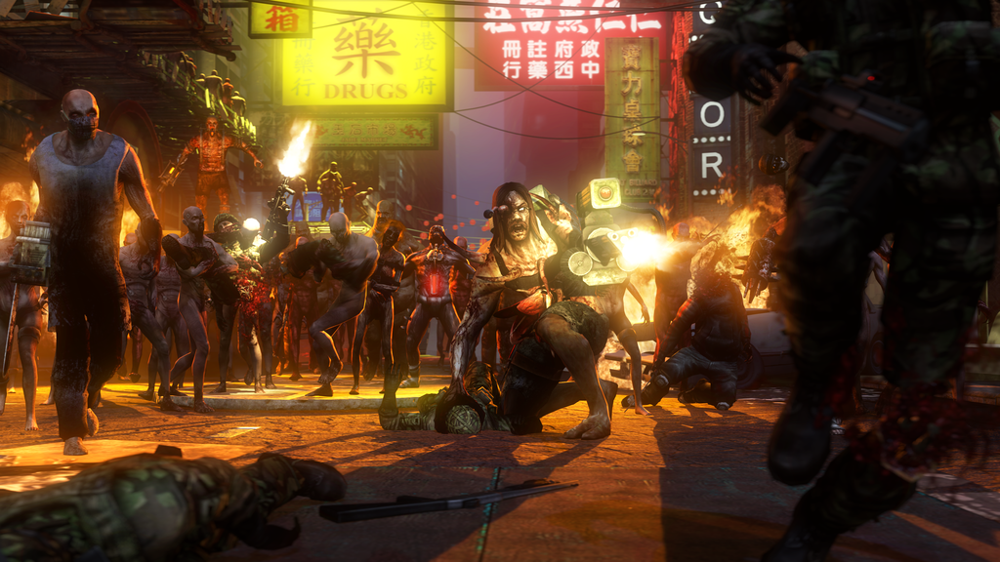

### Fright Yard 30WC

* KFO-FrightYard_30wavechallenge.rom
* Links - [Mediafire](<https://www.mediafire.com/file/18epcoawl0opm3r/KFO-FrightYard_30wavechallenge.zip/file>), [Workshop](<https://steamcommunity.com/sharedfiles/filedetails/?id=299267623>)

### Hospital Horrors 30WC

* KFO-Hospitalhorrors_30wavechallenge.rom
* Links - [Mediafire](<https://www.mediafire.com/file/hha8xv9f5em9t5m/KFO-Hospitalhorrors_30wavechallenge.zip/file>), [Workshop](<https://steamcommunity.com/sharedfiles/filedetails/?id=307472605>)

### Moonbase 30WC

* KFO-MoonBase_30wavechallenge.rom
* Links - [Mediafire](<https://www.mediafire.com/file/bcsd12qeiusgc8k/KFO-MoonBase_30wavechallenge.zip/file>), [Workshop](<https://steamcommunity.com/sharedfiles/filedetails/?id=302962518>)

### Station 30WC

* KFO-Station_30wavechallenge.rom
* Links - [Mediafire](<https://www.mediafire.com/file/mokftfsm5am97ot/KFO-Station_30wavechallenge.zip/file>), [Workshop](<https://steamcommunity.com/sharedfiles/filedetails/?id=330736115>)

### Steamland 30WC

* KFO-Steamland_30wavechallenge.rom
* Links - [Mediafire](<https://www.mediafire.com/file/8dk08h1gj2eo24o/KFO-Steamland_30wavechallenge.zip/file>), [Workshop](<https://steamcommunity.com/sharedfiles/filedetails/?id=290897621>)

## Run Kitty Run

* Authors - [*Lethalvortex*](./tech/Links.md#Lethalvortex)
* KFO-RunKittyRun_desertv3.rom
* Links - [Mediafire](<https://www.mediafire.com/file/o6jtyr24w0p4rds/KFO-RunKittyRun_desertv3.zip/file>), [Workshop](<https://steamcommunity.com/sharedfiles/filedetails/?id=299117328>)
* Notes - *Greylisted*

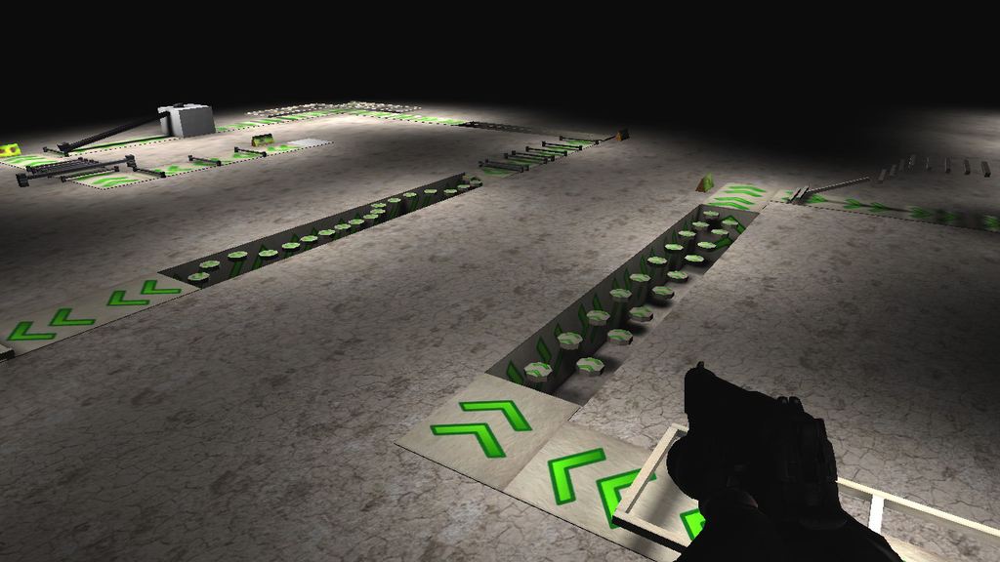

## Hell's Fire

* Authors - [*U.N.C.L.E.*](./tech/Links.md#U.N.C.L.E.)
* KFO-HellsFire.rom
* KFO-HellsFire-Expert.rom
* KFO-HellsFire-Novice.rom
* Links - [Mediafire](<https://www.mediafire.com/file/4n3l4rbm7t668vv/KFO-HellsFire.zip/file>), [Workshop](<https://steamcommunity.com/sharedfiles/filedetails/?id=639953551>)
* Notes - *Greylisted*

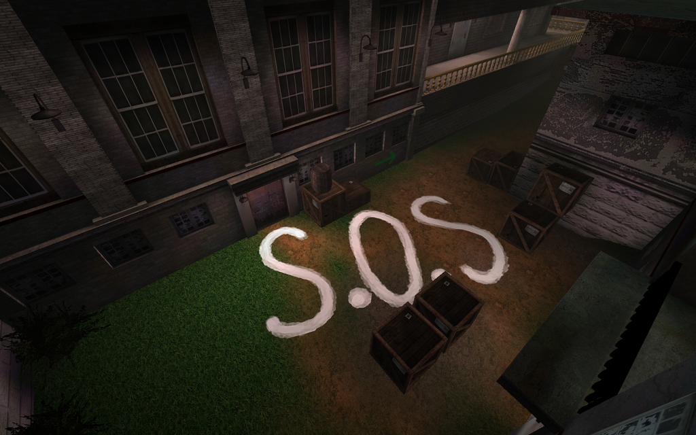
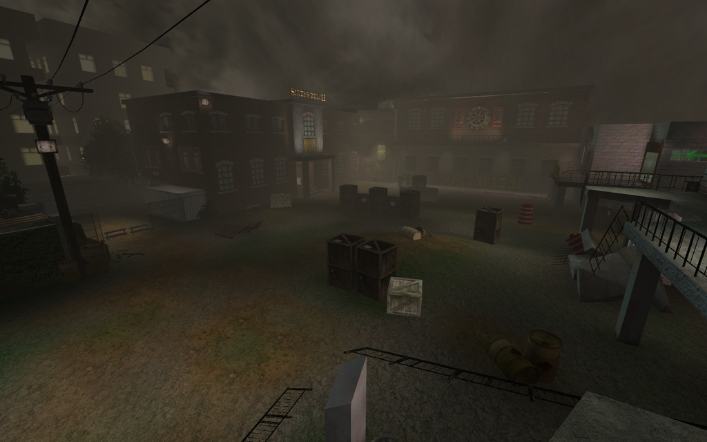

## Lerwick Wonder

* Authors - [*PiX*](./tech/Links.md#PiX)
* KFO-LerwickWonder-beta1f.rom
* Links - [Mediafire](<https://www.mediafire.com/file/1y74cxnpewqa88x/KFO-LerwickWonder-beta1f.zip/file>), [Forum](<https://forums.tripwireinteractive.com/index.php?threads/kf-lerwickwonder-beta1.72326/>)


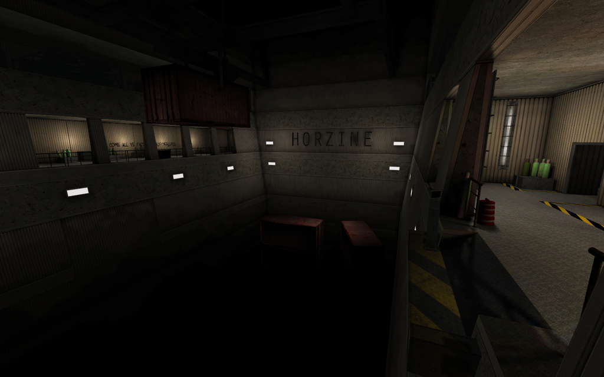

## Lerwick Wonder Lazy Fix

* Authors - [*PiX*](./tech/Links.md#PiX) & [*Holy Username Batman!*](./tech/Links.md#Batman)
* KFO-LerwickWonder-LazyFix.rom
* Links - [Mediafire](<https://www.mediafire.com/file/7cd6lfi4jwbmie2/KFO-LerwickWonder-LazyFix.zip/file>), [Workshop](<https://steamcommunity.com/sharedfiles/filedetails/?id=2274319712>)

## Manufractured

* Authors - [*Smiff*](./tech/Links.md#Smiff)
* KFO-ManufracturedB2.rom
* Links - [Mediafire](<https://www.mediafire.com/file/c06evi565timp12/KFO-ManufracturedB2.zip/file>), [Workshop](<https://steamcommunity.com/sharedfiles/filedetails/?id=172817252>), [Forum](<https://forums.tripwireinteractive.com/index.php?threads/kfo-manufracturedb1.97098/>)


## Containment Station (Solo)

* Authors - [*Fel*](./tech/Links.md#Fel)
* KFO-ContainmentStationBETA.rom
* Links - [Mediafire](<https://www.mediafire.com/file/9ux55vonb3at50t/KFO-ContainmentStationBETA.zip/file>), [Forum](<https://forums.tripwireinteractive.com/index.php?threads/kfo-containmentstation-beta.95803/>)


