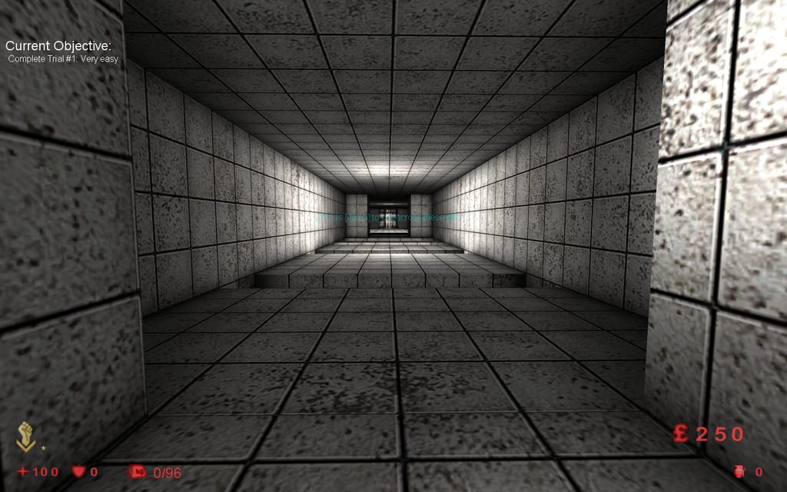
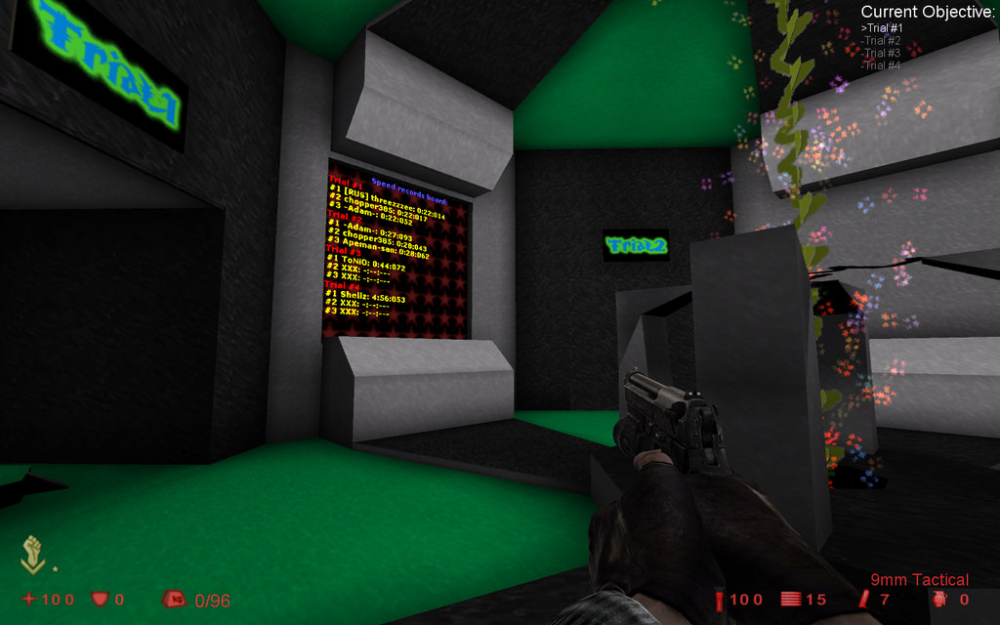
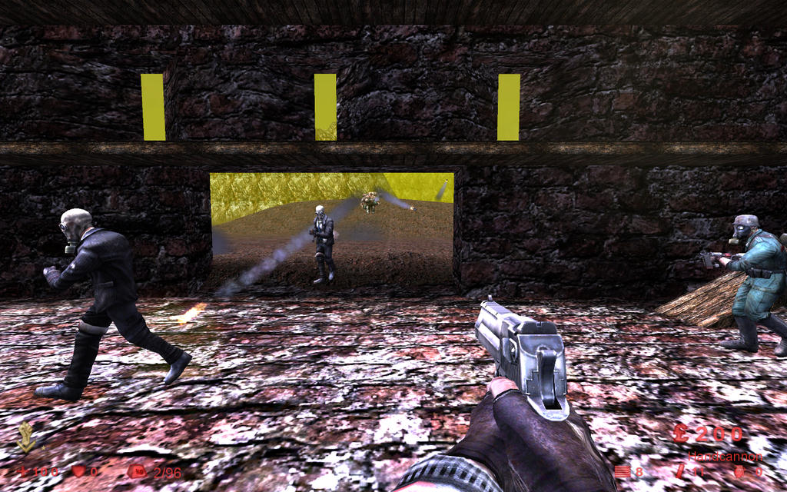
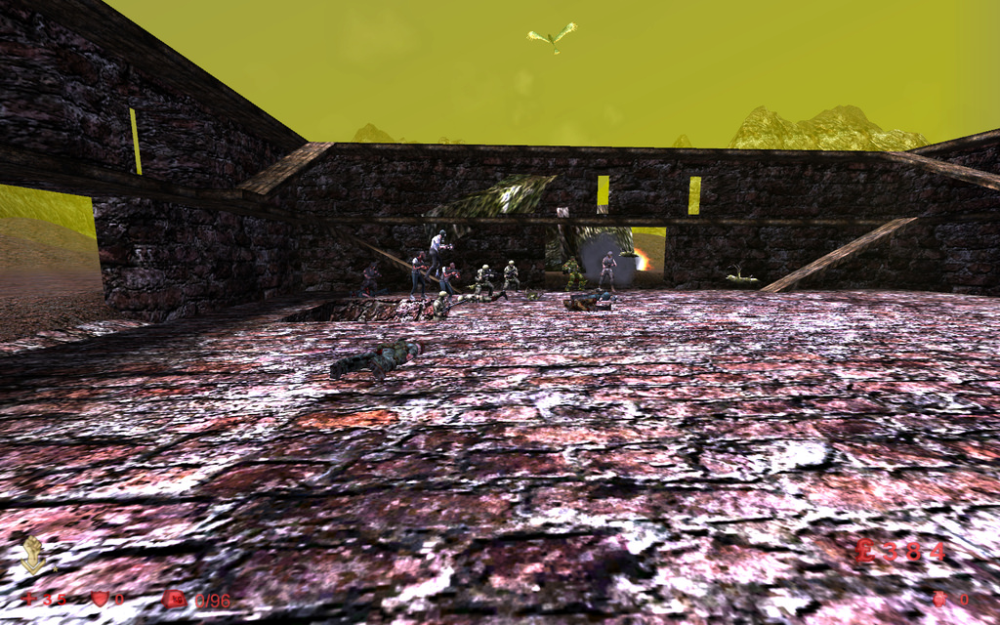
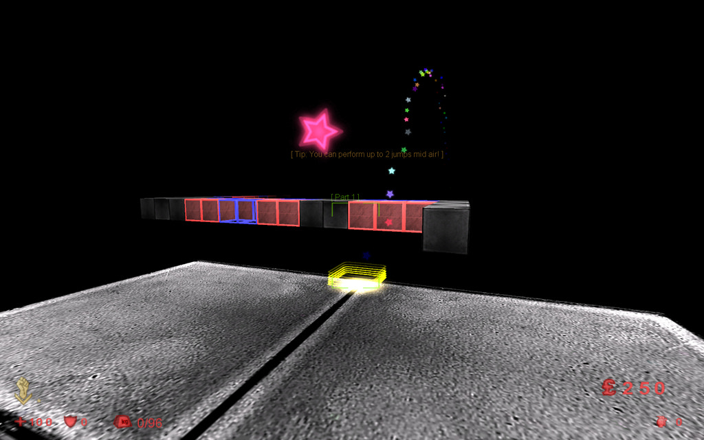
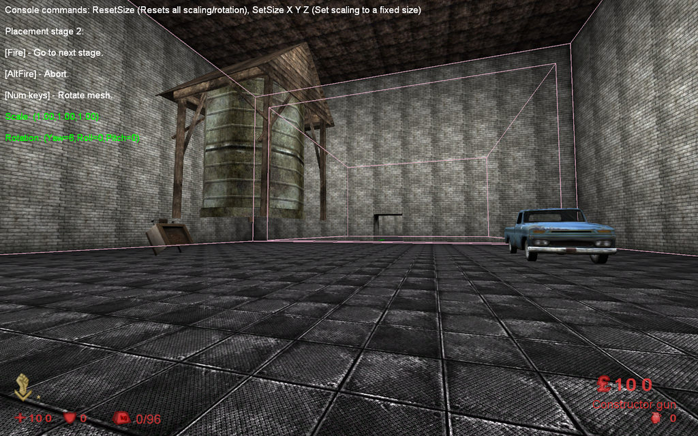

This is a silly mod inspired by Trials in UT2004. It features objectives you have to go through, record speed runs, rankings based on speed runs, double / multi jumping support and dodging / walldodging support. By interface it is slightly like UT2004 Assault © [*Marco*](./tech/Links.md#Marco)

Cmdline for dedicated servers:

```bash
Game=TrialsMod.TrialGame
```

## Trials v1.0

* Authors - [*Marco*](./tech/Links.md#Marco)
  * TR-Tutorial.rom
  * TR-PowerGenerator-M.rom
  * TR-Sulferon.rom
  * TR-BeatTrials.rom
* Links - [Mediafire](<https://www.mediafire.com/file/hd5eo4e233afbew/TrialsMod_Full.zip/file>), [Github](<https://github.com/InsultingPros/KFStory-Assets/releases/download/assets/TrialsMod.Full.zip>), [Forum](<https://forums.tripwireinteractive.com/index.php?threads/gametype-trials-mod.103311/>)
* Notes - PowerGenerator-M requires [Doom I / II mod](./Doom.md#doom-i--ii-mod)







## Construction

* Authors - [*Marco*](./tech/Links.md#Marco)
* TR-Construct.rom
* Links - [Mediafire](<https://www.mediafire.com/file/0sd9yz4v7wxibwz/TR-Construct.zip/file>), [Github](<https://github.com/InsultingPros/KFStory-Assets/releases/download/assets/TR-Construct.zip>)


